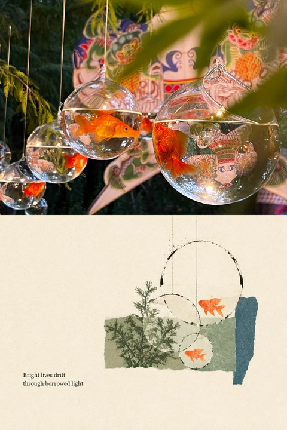
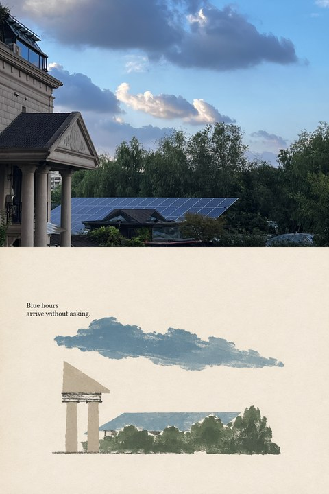
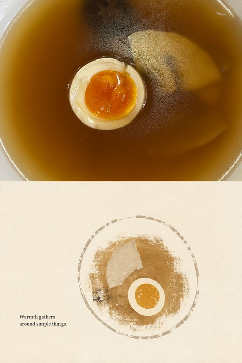
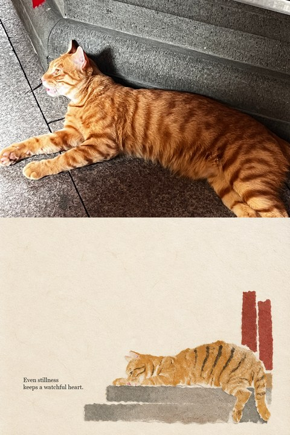
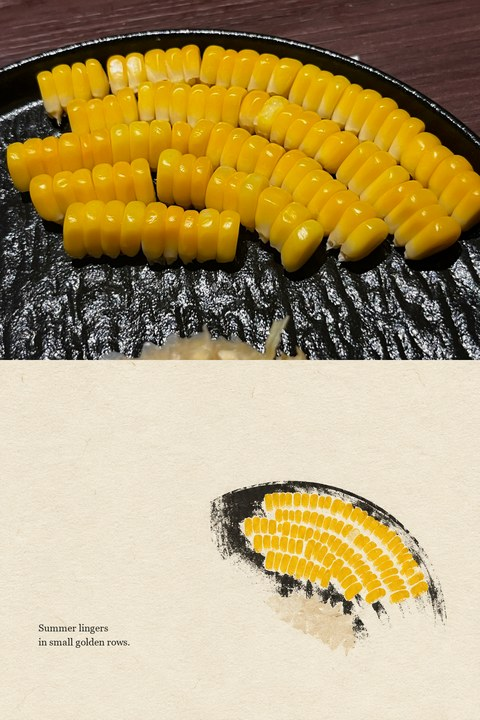

# Minimal Structural Collage · 极简结构拼贴

将任意照片转化为纵向 `2:3` 的高级编辑拼贴：**上半保留未经 AI 重绘的原始实拍，下半提炼为高留白的抽象纸本结构。**

Turn any photograph into a vertical `2:3` editorial collage: **the untouched source photo above, a quiet abstract paper composition below.**

## Showcase · 成品展示

<p align="center">
  
  
  
</p>

<p align="center">
  
  
</p>

## 核心特点

- 严格纵向 `2:3`，默认输出 `1024 × 1536 px`
- 上下约 `1:1`，分界干净，无厚边框
- 上半使用原图确定性缩放与裁切，不重绘、不锐化、不磨皮、不改变比例
- 下半优先抽象重心、方向、面积、遮挡、负形与色彩节奏，而不是照着物体描画
- 保留约 `60–75%` 连续留白，只使用少量低饱和块面、断裂线条与纸本颗粒
- 默认加入一则两行英文小字，并在生成后使用真实字体排版，避免伪文字
- 附带组装、排字与来源验证脚本

> 核心原则：抽象的是关系，不是简单地把物体画成插画。  
> Abstract the relationships, not merely the object.

## 使用方法

把照片交给支持图像生成或图像编辑的 Agent，并调用：

```text
使用 $minimal-structural-collage 把这张照片制作成上半保留原图、
下半关系优先的高留白抽象纸本构成 2:3 拼贴。
```

English:

```text
Use $minimal-structural-collage to turn this photograph into a vertical
2:3 collage with the untouched source image above and a quiet,
relationship-first abstract paper composition below.
```

给其他 Agent 或普通图像 AI 使用时，直接复制 [`references/universal-prompt.md`](references/universal-prompt.md)。其中包含中文一次生成版、可靠的两步工作流与英文 Prompt。

## 安装

克隆仓库到个人 Skills 目录：

```bash
git clone https://github.com/Yuwannn122/minimal-structural-collage-skill.git ~/.codex/skills/minimal-structural-collage
```

Windows 默认位置：

```text
%USERPROFILE%\.codex\skills\minimal-structural-collage
```

运行脚本需要 Python 3.10+ 与 Pillow。生成部分还需要支持参考图或图像编辑的工具。

## 工作方式

1. 根据原图生成无字的下半抽象纸本构成。
2. 用脚本把未经重绘的原图确定性放回上半区。
3. 使用真实衬线字体加入两行英文小字。
4. 验证尺寸、分界、上半来源与原图比例。

## 目录

```text
minimal-structural-collage/
├── SKILL.md
├── README.md
├── agents/
│   └── openai.yaml
├── examples/
│   ├── cloud-garden.jpg
│   ├── corn.jpg
│   ├── egg-broth.jpg
│   ├── goldfish.jpg
│   └── temple-cat.jpg
├── references/
│   ├── style-spec.md
│   └── universal-prompt.md
└── scripts/
    ├── add_caption.py
    ├── assemble_collage.py
    ├── image_io.py
    ├── normalize_images.py
    └── verify_collage.py
```

## English Overview

Minimal Structural Collage separates source fidelity from artistic generation. The upper panel is assembled from the original photograph using deterministic proportional resizing and cropping. It is never AI-repainted, beautified, sharpened, recolored, or distorted.

The lower panel translates the source through visual weight, directional axes, overlap, negative shapes, and muted color rhythm. It should read as structure and space before it reads as a literal object or portrait. A tiny two-line English caption is added afterward with a real font for reliable spelling.

## Privacy · 隐私

仓库展示仅使用不含人物或人体局部的精选成品图。原始照片、人像、含可识别人物的图片、本地路径、微信临时文件、生成缓存与个人元数据均未上传。

The showcase contains only selected finished examples without people or visible body parts. Source photos, portraits, local paths, temporary files, caches, and personal metadata are not included.
